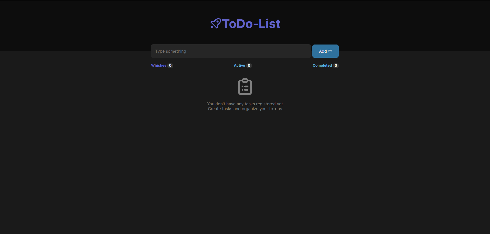
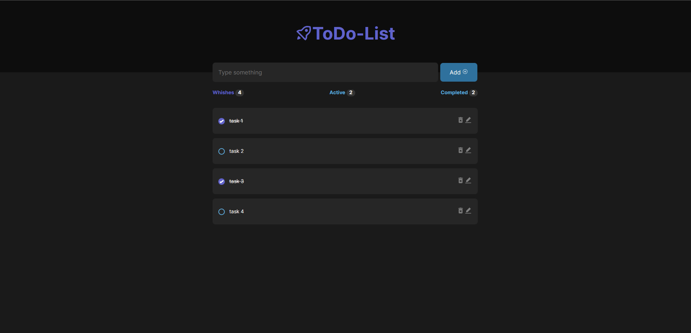

# To do list








_This is an application to create a list of tasks that you can then mark as completed, edit and delete them. The information is saved in the localstorage so it is persistent when closing and reopening the web page. You can filter by all tasks, active tasks or completed tasks._


## Getting Started  🚀

_These instructions will allow you to get a copy of the project running on your local machine for development and testing purposes._


## Prerequisites 📋

_First, you will need to clone the repo:_

```
git clone git@github.com:davidmoina/wishlist-project.git
```

##  Installation🔧

_After cloning the project you will need to install some libraries that are necessary for the correct functioning of the project._

_Install the dependencies_

```
npm install
```

_Once the dependencies are installed you can run the project with the following command._

```
npm run dev
```

## Deploy📦

_To deploy this project, you will need to run the following command:_
```
npm run build
```

## Built with 🛠️

_This project was built with the following tools:_

* **React**
* **Vite**
* **Javascript**
* **Sass**
* **React router v6**
* **React icons**

## Autors ✒️

* **David Moina** - *Developer* - [davidmoina](https://github.com/davidmoina)

